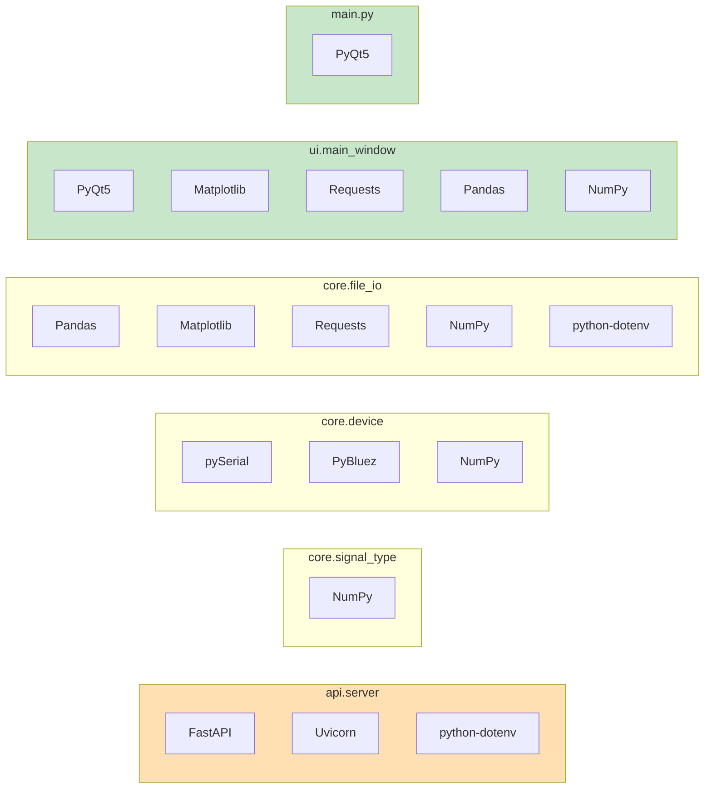

# BITalino biosignals acquisition for Linux

This application was developed to provide BITalino data acquisition, visualization, and playback functionality for Linux users. The official OpenSignals software for BITalino currently supports only Windows and macOS. There's no official Linux support atm. This independent implementation provides BITalino acquisition on Linux without official PLUX software.
- PyBluez/pySerial for direct direct Bluetooth RFCOMM and serial communication
- independent device protocol implementation, handling low-level device communication (no official libs needed)  
- FastAPI backend for device communication
- PyQt5 for a native Linux GUI
- flexible signal processing with custom transfer functions for ECG, EEG, EMG, EDA, and accelerometer data
- real-time matplotlib visualization with multi-channel support and playback capabilities

## Quick start

### 1. Install dependencies

Install:
```bash
pip install -r requirements.txt
```

Create `.env` file:
```dotenv
# rfcomm device path
MAC_ADDRESS=/dev/rfcomm0
DEVICE_MAC=<MAC_ADDRESS>
```

### 2. Quick start options

**Option A: GUI with API**
```bash
./start_gui.sh # Starts both FastAPI server and GUI
```

**Option B: Manual (separate terminals)**
```bash
# Terminal 1: Start API server
python3 -m uvicorn api.server:app --host 127.0.0.1 --port 8000

# Terminal 2: Launch GUI
python3 main.py
```

---

## Entry points

### **GUI App** (`main.py`)
**Use:** Interactive data acquisition with real-time visualization

```bash
python3 main.py
```

1. Choose mode (Acquire data / Load from file)
2. For acquiring select channels and signal types / For playback load file to play
3. Click "Start"
4. Data displays in real-time
5. Click "Stop"

---

###  Saved data files in `data/recordings/`

**Filename Format:**
```
data_recording_YYYY-MM-DD_HH-MM_<signal_type>.txt # type from the first channel selected
```

---

## Architecture

The application has three layers: PyQt5 GUI for user interaction, hardware abstraction and data processing, and FastAPI backend for device communication.



## Dependencies

- **Python 3.7+**
- **PyQt5** - GUI framework
- **FastAPI/Uvicorn** - REST API backend
- **Matplotlib** - Real-time plotting
- **PyBluez** - Bluetooth connectivity
- **numpy** - Data processing
- **pyserial** - Serial communication
- **pandas** - Dataframe parsing and saving
- **requests** - API client with retries
- **python-dotenv** - Load `.env` configuration


---

## BITalino hardware pin mapping

| Physical Pin | Software Channel | Type | Use |
|--------------|------------------|------|-----|
| A1 - A6 | `A1` - `A6` | Analog input | Sensors (ECG, EMG, ACC, EDA, etc.) |
| I1, 02/I2 | `D0`, `D1` | Digital input | Button, switch, or digital sensor |
| PWM | - | Digital output (Control LEDs, motors) | - |

---

### Folder structure

```
biosignals/
├── api/                   # FastAPI BACKEND
│   └── server.py          # HTTP endpoints for device communication
|
├── core/                  # CORE DEVICE AND DATA HANDLING
│   ├── device.py          # BITalino hardware abstraction
│   ├── mock_device.py     # Mock device for testing
│   ├── signal_type.py     # Signal definitions and transfer functions
│   └── file_io.py         # Data acquisition and real-time plotting
|
├── ui/                    # USER INTERFACE
│   └── main_window.py     # PyQt5 GUI application
|
├── data/
│   └── recordings/        # LOCATION OF SAVED DATA FILES
|
├── requirements.txt       
├── main.py                # Entry point for GUI
└── start_gui.sh           # Automated startup script
```

---


## API (`api/`)

### `server.py` - FastAPI Backend
**Purpose:** HTTP REST API for device communication

**Endpoints:**

| Endpoint | Method | Purpose |
|----------|--------|---------|
| `/bitalino-health/` | GET | Lightweight device discovery |
| `/bitalino-data/` | POST | Acquire data with channel selection |

**Example**
```bash
# Health check
curl "http://127.0.0.1:8000/bitalino-health/?macAdd=<MAC_ADDRESS>"

# Get data (POST)
curl -X POST http://127.0.0.1:8000/bitalino-data/ \
  -H "Content-Type: application/json" \
  -d '{"macAddress":"<MAC_ADDRESS>","channels":"A1,D1","nsamples":100}'
```

---

## Core (`core/`)

### `device.py` - BITalino
**Purpose:**  Bluetooth/serial communication with BITalino device

**Methods:**
- `find()` - Discover available BITalino devices via Bluetooth
- `open()` - Open a connection to a BITalino device over Bluetooth or serial
- `start()` - Start acquisition on specified channels
- `stop()` - Stop acquisition
- `close()` - Close connection and cleanup
- `write()` - Write a single control byte to the device. (Helps recover from occasional Bluetooth or serial hiccups without requiring a full reconnect.)
- `read()` - Read data from device
- `decode()` - Return decoded data

---

### `signal_type.py` - Signal Definitions
**Purpose:** Signal types and their properties (unit, range, sampling rate, transfer functions for each type)

**Signals:**
- `ECG` - Electrocardiogram
- `EEG` - Electroencephalogram
- `EMG` - Electromyography
- `ACC` - Accelerometer
- `EDA` - Electrodermal Activity
- `None` - Raw data

---

### `file_io.py` - Data acquisition and I/O
**Purpose:** Real-time multi-channel data acquisition and plotting, and file saving with time stamps.

**Methods:**
- `setup_logging()`
- `create_requests_session()`
- `parse_acquisition_response()` - Parse API response
- `write_to_file()` - Save data to file
- `realtime_acquisition()` - Main acquisition loop

---

## UI (`ui/`)

### `main_window.py` - PyQt5 GUI
Graphical interface for data acquisition and playback

**Features:**
- Real-time signal plotting with embedded matplotlib
- Channel and signal type selection
- Acquisition and data playback control

**Methods:**
- `mode_changed()` - Acquire or playback mode
- `selection_changed()` - Called whenever channel selection or plot mode changes.
- `get_selected_channels()` - Return channels and types
- `is_channel_hidden()` - Check if channel is hidden for button state
- `toggle_channel_plot()` - Hide/show channel plot and rebuild to resize.
- `toggle_all_plots_visibility()` - Hide/show all plots with one button
- `init_data()` - Initialize for data acquisition
- `load_file()` - Load data file to play

---

## Troubleshooting

### Bluetooth connection issues

**BITalino devices don't need to be "connected" via bluetoothctl. 
They only need to be **paired** and **trusted**. The application connects directly via RFCOMM.

**Initial pairing (one-time setup):**
```bash
bluetoothctl
# > scan on
# > pair <MAC_ADDRESS>
# > trust <MAC_ADDRESS>
# > exit
```

**After pairing, run the GUI:**
```bash
./start_gui.sh
```

**Optional: Bind rfcomm device (for serial access):**
```bash
sudo rfcomm release /dev/rfcomm0
sudo rfcomm bind /dev/rfcomm0 <MAC_ADDRESS> 1
```

---

### Device permissions

If you get permission errors accessing `/dev/rfcomm0`:
```bash
# Add your user to dialout group
sudo usermod -a -G dialout $USER
# Log out and log back in for changes to take effect
```

